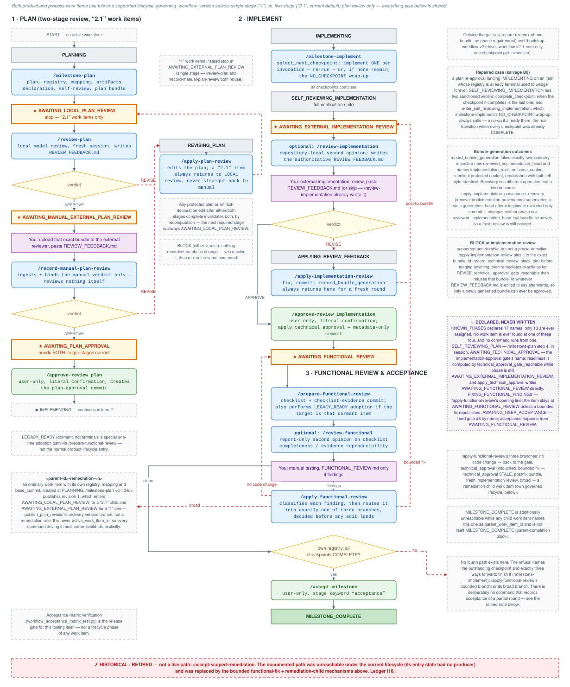

# Workflow v2.1 — Operator Reference



Quick reference for manually shepherding a work item through the current
command set. Describes the workflow **as it exists today**, not as it might
be redesigned.

Authoritative sources: `.claude/commands/*.md`,
`docs/ai-workflow/MILESTONE_WORKFLOW.md`,
`docs/ai-workflow/REVIEW_PROTOCOL.md`,
`docs/ai-workflow/PLAN_REVIEW_WORKFLOW.md`, `scripts/workflow_state.py`.
Where they disagree, see [Known discrepancies](#known-discrepancies).

---

## How to read this

- **States/phases** live in `docs/ai-workflow/WORKFLOW_STATE.json` per work
  item (`work_items[<id>].phase`). Check ground truth with:
  `python3 -c "import json;print(json.load(open('docs/ai-workflow/WORKFLOW_STATE.json'))['work_items'])"`
- **Two governing versions** exist per work item, fixed at creation:
  `"1"` (single-stage plan review) and `"2.1"` (two-stage plan review,
  current default in `WORKFLOW_CONFIG.json`). A `"2.1"` item's plan review
  is the part most people get wrong — see below.
- **User-only commands** (`/approve-review`, `/accept-milestone`,
  `/accept-scoped-remediation`) carry `disable-model-invocation: true`.
  Claude cannot run them, and they refuse to write anything unless *your
  current-turn message* contains literal confirmation text naming the exact
  work item and stage. They also do not appear in Claude's skill list.
- **Every command stops.** None of them chain into the next command, even
  when the next step is obvious.

## Typical workflow (happy path, a `"2.1"` item)

```
/milestone-plan                     → AWAITING_LOCAL_PLAN_REVIEW
/review-plan            (APPROVE)   → AWAITING_MANUAL_EXTERNAL_PLAN_REVIEW
  you: upload bundle → paste REVIEW_FEEDBACK.md
/record-manual-plan-review (APPROVE)→ AWAITING_PLAN_APPROVAL      ★ gate
/approve-review plan     (you)      → IMPLEMENTING
/milestone-implement     (× N, one checkpoint each)
                                    → AWAITING_EXTERNAL_IMPLEMENTATION_REVIEW  ★ gate
  you: external review → paste REVIEW_FEEDBACK.md
/apply-implementation-review        → AWAITING_TECHNICAL_APPROVAL  ★ gate
/approve-review implementation (you)→ AWAITING_FUNCTIONAL_REVIEW   ★ gate
/prepare-functional-review
  you: manual testing → FUNCTIONAL_REVIEW.md (only if findings)
/apply-functional-review            → back to AWAITING_FUNCTIONAL_REVIEW
/accept-milestone        (you)      → MILESTONE_COMPLETE
```

At either plan-review verdict, `REVISE` diverts through
`/apply-plan-review`, which always returns the item to
`AWAITING_LOCAL_PLAN_REVIEW` — never straight back to manual review.

## The two-stage plan review (the part that causes confusion)

A `"2.1"` work item has **two** distinct plan reviews, in a fixed order.
They are not interchangeable and neither one approves the plan.

| Step | Who | Command | Records |
|---|---|---|---|
| 1. Local model review | Claude, ideally a fresh session | `/review-plan` | Writes `REVIEW_FEEDBACK.md` itself; on `APPROVE` records the `local_model_plan_review` ledger stage |
| 2. Manual external review | **You** — upload the bundle to an external reviewer, paste its verdict into `REVIEW_FEEDBACK.md` | `/record-manual-plan-review` | Ingests and binds the verdict you already pasted; on `APPROVE` records the `manual_external_plan_review` ledger stage |
| 3. Approval | **You** | `/approve-review plan` | The only approval gate; requires **both** ledger stages recorded against the *current* `review_content_id` |

Key points:

- `/review-plan` **performs and writes** a review. It is the reviewer.
- `/record-manual-plan-review` **performs no review at all**. It never reads
  the plan for quality and never edits it — it only ingests and binds a
  verdict a human reviewer already produced and already pasted into
  `REVIEW_FEEDBACK.md` in the same turn. Nothing in the workflow can act on
  an external review until this command has bound it.
- Then, by verdict:
  - **`REVISE`** (either stage) → `/apply-plan-review`.
  - **`APPROVE`** at stage 1 → the manual external review is next (upload,
    paste, `/record-manual-plan-review`). `APPROVE` at stage 2 →
    `/approve-review plan`.
  - **`BLOCK`** (either stage) → nothing is recorded, the phase does not
    change. Resolve it with the user explicitly, then re-run.
- The manual-stage feedback file must declare
  `Reviewer role: manual_external_plan_review` **exactly**, and its
  `review_content_id` must match the current recomputed value, or ingestion
  is refused. A mismatched `bundle_id` only warns.
- Any edit to a protected plan doc changes `review_content_id`, which makes
  **both** ledger stages read as absent immediately. There is no clear step;
  it is by recomputation.

A `"1"` item skips all of this: it goes `AWAITING_EXTERNAL_PLAN_REVIEW` →
`/apply-plan-review` → `AWAITING_PLAN_APPROVAL`. `/review-plan` and
`/record-manual-plan-review` both refuse cleanly against a `"1"` item.

## Which command do I run next?

| Current phase / situation | Run this |
|---|---|
| `PLANNING`, or starting a milestone | `/milestone-plan` |
| `AWAITING_LOCAL_PLAN_REVIEW` (`"2.1"`) | `/review-plan` — ideally a fresh session |
| `AWAITING_MANUAL_EXTERNAL_PLAN_REVIEW` | Upload the named bundle, paste the verdict into `REVIEW_FEEDBACK.md`, then `/record-manual-plan-review` |
| `AWAITING_EXTERNAL_PLAN_REVIEW` (`"1"` only) | Paste external feedback, then `/apply-plan-review` |
| Any plan verdict was `REVISE` | `/apply-plan-review` → returns to `AWAITING_LOCAL_PLAN_REVIEW` |
| Any verdict was `BLOCK` | Nothing. Resolve with the user, then re-run the same command |
| `REVISING_PLAN` | `/apply-plan-review` |
| `AWAITING_PLAN_APPROVAL` | **You**: `/approve-review plan <work-item-id>` with literal confirmation |
| `IMPLEMENTING` | `/milestone-implement` — once per checkpoint, repeat until it reports all complete |
| `SELF_REVIEWING_IMPLEMENTATION` | `/milestone-implement` again (it runs verification + generates the bundle) |
| `AWAITING_EXTERNAL_IMPLEMENTATION_REVIEW` | Paste external feedback, then `/apply-implementation-review` |
| Same, but `/approve-review implementation` fails on provenance after an unrelated doc/scripts commit | `/recover-implementation-provenance` |
| `APPLYING_REVIEW_FEEDBACK`, blocking findings remain | Another external review round → `/apply-implementation-review` |
| `AWAITING_TECHNICAL_APPROVAL` | **You**: `/approve-review implementation <work-item-id>` |
| `AWAITING_FUNCTIONAL_REVIEW`, no checklist yet | `/prepare-functional-review` |
| Functional testing produced findings | `/apply-functional-review` |
| Functional testing clean, **all** own checkpoints `COMPLETE` | **You**: `/accept-milestone` |
| Functional testing clean, a checkpoint still outstanding | **You**: `/accept-scoped-remediation` → returns to `IMPLEMENTING` |
| Review needed for work outside the gates | `/prepare-review` |
| Driving the `workflow-v2-1-core` item | `/bootstrap-workflow-v2` (only command for it) |

Unsure which acceptance command? The rule is mechanical: if the item's own
registry has any checkpoint that is not `COMPLETE`,
`/accept-scoped-remediation` is correct and `/accept-milestone` refuses;
otherwise the reverse. Both refuse for the wrong item, naming the other.

---

## Command reference

All 14 commands currently in `.claude/commands/`. `[work-item-id]` defaults
to `active_work_item_id` where accepted.

### `/milestone-plan [base-sha]`
- **When**: starting or resuming a milestone's plan.
- **Expects**: `PLANNING`, or an existing non-terminal work item to resume.
- **Does**: identifies the next incomplete milestone, writes the execution
  plan, generates the registry/mapping/artifacts declarations, self-reviews,
  and builds the plan bundle.
- **Writes**: plan doc, `registry/<id>-registry.json`,
  `requirements/<id>-mapping.json`, `registry/<id>-artifacts.json`,
  `WORKFLOW_STATE.json`, plan bundle. No commits.
- **Next**: `AWAITING_LOCAL_PLAN_REVIEW` (`"2.1"`) or
  `AWAITING_EXTERNAL_PLAN_REVIEW` (`"1"`).
- **Refuses**: reuse of a terminal or previously-used `work_item_id`; a
  checkpoint id reintroduced after retirement; a `REJECTED` bundle marker.

### `/review-plan [work-item-id]`
- **When**: immediately after `/milestone-plan` or `/apply-plan-review`, on a
  `"2.1"` item. Strongly recommended in a **fresh session**.
- **Expects**: `phase == AWAITING_LOCAL_PLAN_REVIEW`, `"2.1"` only.
- **Does**: independently re-verifies the plan against the repository —
  including every finding the plan claims as addressed — and decides
  `APPROVE`/`REVISE`/`BLOCK`.
- **Writes**: `REVIEW_FEEDBACK.md` (with `Reviewer role:
  local_model_plan_review`) and, on `APPROVE` only, the ledger stage + phase
  in `WORKFLOW_STATE.json`. Never the plan, registry, mapping, or bundle.
- **Next**: `APPROVE` → `AWAITING_MANUAL_EXTERNAL_PLAN_REVIEW`; `REVISE` →
  `REVISING_PLAN`; `BLOCK` → stays put.
- **Refuses**: a `"1"` item; wrong phase (including a re-run after this
  round already completed); a stale bundle vs. `MANIFEST.md`; a worktree/HEAD
  mismatch; a `REJECTED` bundle.

### `/record-manual-plan-review [work-item-id]`
- **When**: after you have pasted the external reviewer's verdict into
  `REVIEW_FEEDBACK.md`, in the same turn.
- **Expects**: `phase == AWAITING_MANUAL_EXTERNAL_PLAN_REVIEW`, `"2.1"` only.
- **Does**: mechanically ingests and binds that verdict. Evaluates nothing.
- **Writes**: `WORKFLOW_STATE.json` only (ledger stage on `APPROVE`, phase on
  `APPROVE`/`REVISE`). Never the feedback file, plan, registry, or bundle.
- **Next**: `APPROVE` → `AWAITING_PLAN_APPROVAL`; `REVISE` → `REVISING_PLAN`;
  `BLOCK` → stays put.
- **Refuses**: `Reviewer role:` that is not exactly
  `manual_external_plan_review`; a `review_content_id` that does not match
  the current recomputed value (hard); a missing current local `APPROVE`; a
  duplicate ingestion for the same `review_content_id`. A mismatched
  `bundle_id` **warns only**. Not an approval gate.

### `/apply-plan-review`
- **When**: a plan review returned `REVISE` (either stage, or a `"1"` item's
  single stage).
- **Expects**: `REVIEW_FEEDBACK.md` present and binding-field-valid; enters
  `REVISING_PLAN`.
- **Does**: validates every finding against the repository, applies accepted
  ones, records evidence-based rejections inline in the plan.
- **Writes**: plan doc, bundle `PLAN.md`, registry/mapping when the plan
  revision advances, `WORKFLOW_STATE.json`, regenerated plan bundle. No
  product code.
- **Next**: `"2.1"` → **always** `AWAITING_LOCAL_PLAN_REVIEW`, regardless of
  edit size. `"1"` → `AWAITING_PLAN_APPROVAL`.
- **Refuses**: missing feedback; feedback whose bundle/base/work-item binding
  fields do not match; a `REJECTED` bundle. Never self-declares the plan
  ready on a `"2.1"` item.

### `/approve-review <plan|implementation> [work-item-id]` — user-only
- **When**: at `AWAITING_PLAN_APPROVAL` or `AWAITING_TECHNICAL_APPROVAL`.
- **Expects**: the matching gate to be reachable. For `plan` on a `"2.1"`
  item, both ledger stages must be current.
- **Does**: recomputes `bundle_id`/`review_content_id` fresh, resolves the
  approval basis (`EXTERNAL_APPROVE` when the current feedback says
  `APPROVE` and its bundle id matches exactly, otherwise `USER_OVERRIDE`),
  and creates the approval commit.
- **Writes**: `plan_approval`/`technical_approval` in `WORKFLOW_STATE.json`
  plus one approval commit — plan stage: plan + registry + mapping + state
  (+ artifacts declaration when pending and fresh), via a crash-resumable
  journal; implementation stage: metadata-only, zero production/test changes.
- **Next**: `plan` → `IMPLEMENTING`; `implementation` →
  `AWAITING_FUNCTIONAL_REVIEW`.
- **Refuses**: no literal current-turn confirmation naming the exact work
  item and stage; a `BLOCK` status (and, at the implementation stage, a
  durably pinned `BLOCK` even if the feedback file was later edited); a
  dirty protected path; a stale worktree/HEAD; a failed provenance interval;
  an already-open approval journal (report evidence and stop — takeover needs
  a separate literal authorization).

### `/milestone-implement [work-item-id]`
- **When**: `IMPLEMENTING`, once per checkpoint.
- **Expects**: `plan_approval.status == CURRENT`, the approval commit an
  ancestor of HEAD, and the recomputed plan-stage `review_content_id` still
  matching what was approved.
- **Does**: selects and implements exactly **one** checkpoint, runs the
  narrowest relevant check, commits it with
  `Workflow-Checkpoint:`/`Workflow-Work-Item:` trailers, then stops. On the
  invocation that first sees every checkpoint `COMPLETE`, it instead
  self-reviews, runs the full suite, and generates the implementation bundle.
- **Writes**: source/tests, `docs/ACTIVE_MILESTONE.md` (or the requirements
  ledger for a process item), `WORKFLOW_STATE.json`, checkpoint commits, a
  bundle-generation-record commit, bundle files.
- **Next**: `IMPLEMENTING` (more checkpoints) →
  `SELF_REVIEWING_IMPLEMENTATION` → `AWAITING_EXTERNAL_IMPLEMENTATION_REVIEW`.
- **Refuses**: an unreachable/stale plan approval; a checkpoint claimed by
  another worktree; a blocked checkpoint with unmet dependencies. Never loops
  across checkpoints, and never crosses the last-checkpoint→wrap-up boundary
  in one invocation.

### `/apply-implementation-review`
- **When**: external implementation-review feedback has been pasted.
- **Expects**: `phase == AWAITING_EXTERNAL_IMPLEMENTATION_REVIEW` — refuses
  outright otherwise, naming the actual phase.
- **Does**: reproduces and validates every Blocking/Important finding, fixes
  what is real, records evidence-based rejections, reruns narrow tests then
  the full suite, commits, and regenerates the `post-fix` bundle.
- **Writes**: source/tests, `IMPLEMENTATION_SUMMARY.md`,
  `WORKFLOW_STATE.json` (durable `BLOCK` pin, bundle-generation record),
  fix commits, one generation-record commit, bundle.
- **Next**: `AWAITING_TECHNICAL_APPROVAL`, or back to
  `AWAITING_EXTERNAL_IMPLEMENTATION_REVIEW` if blocking findings remain or
  the fix was structurally significant.
- **Caveats**: a `BLOCK` verdict is pinned durably to the bundle id, so
  editing the feedback file afterwards cannot make it override-eligible. The
  generation-record commit must land **before** bundle generation.

### `/recover-implementation-provenance [work-item-id]`
- **When**: `/approve-review implementation` fails its provenance check only
  because a legitimate excluded-only commit (docs, `scripts/`) landed on top
  of the bundle-generation-record commit.
- **Expects**: `phase == AWAITING_EXTERNAL_IMPLEMENTATION_REVIEW` — the only
  legal source phase.
- **Does**: diagnoses read-only, then records the wider still-identical
  interval with one recovery commit and regenerates the bundle at the new tip.
- **Writes**: `WORKFLOW_STATE.json` (`state_revision`/`last_transition`
  only), one commit with `Workflow-Bundle-Generation-Record` +
  `Workflow-Work-Item` + `Workflow-Supersedes` trailers, regenerated bundle.
  `reviewed_implementation_head`/`implementation_revision` are untouched;
  the phase does not change.
- **Next**: unchanged — still `AWAITING_EXTERNAL_IMPLEMENTATION_REVIEW`.
- **Refuses**: any other phase; content that genuinely changed; no literal
  current-turn confirmation naming the work item **and** the superseded
  commit SHA. Afterwards the `bundle_id` has changed, so prior external
  feedback is stale — a fresh review is needed for an `EXTERNAL_APPROVE`.

### `/prepare-functional-review [work-item-id]`
- **When**: right after `/approve-review implementation`.
- **Expects**: `technical_approval.status == CURRENT`; enters
  `AWAITING_FUNCTIONAL_REVIEW`. Also performs `LEGACY_READY` adoption if the
  target is that dormant item.
- **Does**: confirms verification is current and writes a concrete manual
  test checklist (setup, data, flows, expected results, limitations).
- **Writes**: the checklist in `docs/ACTIVE_MILESTONE.md`, plus a dedicated
  content-idempotent checklist-evidence commit
  (`Workflow-Functional-Checklist:` trailer). May write
  `WORKFLOW_STATE.json` on legacy adoption.
- **Next**: hard gate — you test manually, findings go to
  `FUNCTIONAL_REVIEW.md`.
- **Caveat**: note the reported evidence commit SHA and blob. If this round
  ends in `/accept-scoped-remediation`, your confirmation must quote them
  verbatim; a superseded evidence identity is refused as stale.

### `/apply-functional-review [work-item-id]`
- **When**: `FUNCTIONAL_REVIEW.md` exists with findings.
- **Expects**: `AWAITING_FUNCTIONAL_REVIEW`; enters
  `FIXING_FUNCTIONAL_FINDINGS`.
- **Does**: classifies each finding (defect / usability / missing requirement
  / enhancement / expected behavior), then routes it into one of three
  branches decided **before** any edit lands:
  - *no code change* → back to `AWAITING_FUNCTIONAL_REVIEW`,
    `technical_approval` untouched;
  - *bounded fix* → marks `technical_approval` `STALE` **before** the first
    edit, fixes, commits, regenerates the `post-fix` bundle, and stops at a
    fresh `AWAITING_EXTERNAL_IMPLEMENTATION_REVIEW`;
  - *broad* → creates a child work item `<parent-id>-remediation-<n>` and
    tells you to run `/milestone-plan <child-id>`; nothing is implemented
    inline.
- **Writes**: source/tests, checklist, `WORKFLOW_STATE.json`, commits, bundle.
- **Next**: back to the functional gate, or to a fresh implementation-review
  round if any finding took the bounded branch (the stop is for the whole
  round, not just that finding).
- **Caveat**: enhancements are flagged for you, never silently implemented.

### `/accept-milestone` — user-only
- **When**: functional review is clean **and** every checkpoint in the item's
  own registry is `COMPLETE`.
- **Expects**: `AWAITING_FUNCTIONAL_REVIEW` (or `AWAITING_USER_ACCEPTANCE`)
  and a terminal registry.
- **Does**: closes out the milestone.
- **Writes**: `WORKFLOW_STATE.json` (`MILESTONE_COMPLETE`,
  `active_work_item_id` cleared), `docs/ROADMAP.md`,
  `docs/ACTIVE_MILESTONE.md`, archives plans to `docs/milestones/completed/`,
  completion commit.
- **Next**: `MILESTONE_COMPLETE`; next action is `/milestone-plan`.
- **Refuses**: no literal confirmation naming the work item and the
  `acceptance` stage; any child work item not itself `MILESTONE_COMPLETE`; any
  of the item's own checkpoints not `COMPLETE` (points you at
  `/accept-scoped-remediation`); a registry that fails to resolve or does not
  declare this work item. None of these refusals touch the roadmap or commit.

### `/accept-scoped-remediation [work-item-id]` — user-only
- **When**: functional review is clean for a continued-scope round, but the
  item's own last checkpoint is still outstanding.
- **Expects**: `phase == AWAITING_FUNCTIONAL_REVIEW`, registry **not**
  terminal, `technical_approval.status == CURRENT`.
- **Does**: records your functional acceptance of this round specifically and
  returns the item to `IMPLEMENTING` — never marks the item complete.
- **Writes**: `WORKFLOW_STATE.json` (acceptance entry + `phase`) and one
  dedicated metadata-only provenance commit
  (`Workflow-Scoped-Remediation-Acceptance:` trailer). Leaves
  `checkpoints`/`plan_approval`/`technical_approval` untouched.
- **Next**: `IMPLEMENTING` — resume with `/milestone-implement`.
- **Refuses**: no literal confirmation naming the work item and the
  `scoped_remediation` stage (textually distinct from `acceptance`, so an
  acceptance confirmation can never be reused here); a confirmation missing or
  quoting stale `Functional checklist evidence commit:` / `blob:` values; a
  terminal registry (points you at `/accept-milestone`); a `STALE`
  `technical_approval`; an item with no state entry. An exact replay reports
  the original commit idempotently; a conflicting duplicate is refused.

### `/prepare-review`
- **When**: a one-off review of work that is not part of a tracked milestone
  checkpoint.
- **Expects**: nothing — no phase requirement. The only command with
  `state_writer: false`.
- **Does**: writes the author-side bundle files and runs
  `scripts/prepare-ai-review.sh <base-sha> <stage> [work-item-id]`.
- **Writes**: bundle files only. No state, no commits.
- **Next**: nothing automatic.
- **Caveat**: for gated reviews use the milestone commands instead — they
  populate the bundle correctly for each state. `work-item-id` is required
  when the stage is `plan`.

### `/bootstrap-workflow-v2`
- **When**: driving the `workflow-v2-1-core` work item only (hardcoded, never
  an argument). It is the **sole** driver for that item and is deleted at its
  `MILESTONE_COMPLETE`.
- **Expects**: no open plan-approval journal; a reachable implementing entry.
- **Does**: implements exactly one checkpoint per invocation, then stops —
  never loops, never hands off to `/milestone-implement`. Never reads
  `docs/ACTIVE_MILESTONE.md` or `docs/ROADMAP.md`. On the invocation where no
  checkpoint remains, it runs that item's own Python test suite and generates
  the implementation bundle.
- **Writes**: source/tests, `WORKFLOW_STATE.json`, checkpoint commits, a
  bundle-generation-record commit, bundle files.
- **Next**: one checkpoint per invocation; requires a **fresh session** to
  continue.
- **Caveat**: this item is permanently `governing_workflow_version: "1"`.

---

## Shared refusal conditions

These apply across most commands and are usually what you are hitting:

- **`REJECTED` bundle marker** — every bundle consumer asserts
  `assert_bundle_not_rejected` twice (once on read, once immediately before
  its first write). An unreadable marker counts as present.
- **Stale bundle** — the recomputed `bundle_id`/`review_content_id` must
  match what `MANIFEST.md`/`REVIEW_REQUEST.md` claim.
- **Wrong worktree or HEAD** — `assert_local_generation_matches` compares
  `MANIFEST.md`'s recorded `worktree_root`/`generation_head` against the
  live ones. This is a different check from the bundle id; both run.
- **Binding fields** — every review round's `REVIEW_FEEDBACK.md` must carry
  `Reviewed bundle ID:`, `Reviewed base commit:`, and `Work item:`, matching
  the current values. `FUNCTIONAL_REVIEW.md` has no binding requirement.
- **Wrong phase** — commands name the actual phase and stop rather than
  guessing or silently re-running.

## Phases

From `KNOWN_PHASES` in `scripts/workflow_state.py`:

`PLANNING`, `SELF_REVIEWING_PLAN`, `AWAITING_EXTERNAL_PLAN_REVIEW`,
`REVISING_PLAN`, `AWAITING_LOCAL_PLAN_REVIEW` (2.1),
`AWAITING_MANUAL_EXTERNAL_PLAN_REVIEW` (2.1), `AWAITING_PLAN_APPROVAL`,
`IMPLEMENTING`, `SELF_REVIEWING_IMPLEMENTATION`,
`AWAITING_EXTERNAL_IMPLEMENTATION_REVIEW`, `APPLYING_REVIEW_FEEDBACK`,
`AWAITING_TECHNICAL_APPROVAL`, `AWAITING_FUNCTIONAL_REVIEW`,
`FIXING_FUNCTIONAL_FINDINGS`, `AWAITING_USER_ACCEPTANCE`,
`MILESTONE_COMPLETE`, `LEGACY_READY` (dormant, not terminal).

`MILESTONE_COMPLETE` is the only terminal phase.

Hard gates, per `MILESTONE_WORKFLOW.md`, are exactly six:
`AWAITING_EXTERNAL_PLAN_REVIEW`, `AWAITING_PLAN_APPROVAL`,
`AWAITING_EXTERNAL_IMPLEMENTATION_REVIEW`, `AWAITING_TECHNICAL_APPROVAL`,
`AWAITING_FUNCTIONAL_REVIEW`, `AWAITING_USER_ACCEPTANCE`.

## Known discrepancies

Found while checking this document against the live command files and
`scripts/workflow_state.py`. Recorded, not fixed — this document changes no
behavior.

1. **`/milestone-plan` step 6 names the wrong state for a `"2.1"` item.**
   The step is headed "Enter `AWAITING_EXTERNAL_PLAN_REVIEW`" and step 7 says
   to wait for `REVIEW_FEEDBACK.md`. But for a `"2.1"` item, step 3 has
   already called `publish_plan_revision`, which sets the phase to
   `AWAITING_LOCAL_PLAN_REVIEW` (`workflow_state.py`: `"2.1"` →
   `AWAITING_LOCAL_PLAN_REVIEW`, `"1"` → `AWAITING_EXTERNAL_PLAN_REVIEW`).
   The real next action is `/review-plan`, not an external upload. **The
   code is authoritative**; treat step 6's heading as `"1"`-only wording.
   This is the most likely source of the plan-review confusion.

2. **`MILESTONE_WORKFLOW.md`'s `AWAITING_LOCAL_PLAN_REVIEW` entry condition
   is incomplete.** It lists only "`REVISING_PLAN`'s exit condition is met,
   or `/apply-plan-review` has just applied an accepted plan edit". It omits
   the first entry, straight from `/milestone-plan`'s own
   `publish_plan_revision` call — which is how a fresh `"2.1"` item actually
   arrives there.

3. **`REVIEW_PROTOCOL.md`'s feedback template omits fields the `"2.1"` plan
   commands require.** Its "Required structure" lists only `Status:` and the
   three binding fields. It never mentions `Reviewer role:` or the
   `review_content_id` line, yet `/record-manual-plan-review` hard-refuses
   feedback whose `Reviewer role:` is not exactly
   `manual_external_plan_review`, and `/review-plan` always writes both.
   `MILESTONE_WORKFLOW.md` and `PLAN_REVIEW_WORKFLOW.md` do document them.

4. **`AWAITING_USER_ACCEPTANCE` is documented as hard gate #6 but is never
   written.** `workflow_state.py` says plainly that "no function in this
   codebase writes it" and includes it in
   `milestone_complete_gate_reachable` "for forward compatibility only". In
   practice acceptance happens directly from `AWAITING_FUNCTIONAL_REVIEW`,
   and `scoped_remediation_gate_reachable` accepts *only* that phase.

5. **The "exactly six hard gates" count and the operational stop count
   differ for a `"2.1"` item.** `MILESTONE_WORKFLOW.md` keeps the count at 6
   on the grounds that the two new plan-review states refine one existing
   edge rather than adding gates — but both are documented as "Stop for
   user/reviewer? Yes", so a `"2.1"` item stops at seven places in practice.
   Consistent as written; just do not use the number 6 to predict stops.

6. **`/apply-plan-review` step 6 is `"1"`-only wording with no `"2.1"`
   meaning.** It says a `BLOCK` status should "stay in
   `AWAITING_EXTERNAL_PLAN_REVIEW`", a state a `"2.1"` item never occupies.
   On a `"2.1"` item a `BLOCK` never routes into this command at all (neither
   verdict command transitions on `BLOCK`), and step 7' overrides the exit to
   `AWAITING_LOCAL_PLAN_REVIEW` regardless.

7. **Argument handling is inconsistent across commands.**
   `/apply-functional-review` reads `$ARGUMENTS` for a work-item id but
   declares no `argument-hint` in its frontmatter.
   `/apply-implementation-review` and `/apply-plan-review` reference a
   "target work item" without ever defining how it is resolved, and accept no
   argument — in practice they act on `active_work_item_id`.

8. **`/approve-review plan` still refuses `workflow-v2-1-core`.** Its step 4a
   interim scope guard refuses while
   `docs/ai-workflow/WORKFLOW_V2_PLAN.md` still contains the heading
   "Bootstrap plan-approval procedure" — which it currently does. That item
   is already `MILESTONE_COMPLETE`, so the guard is moot in practice, but it
   is live code for any future use of that id.
